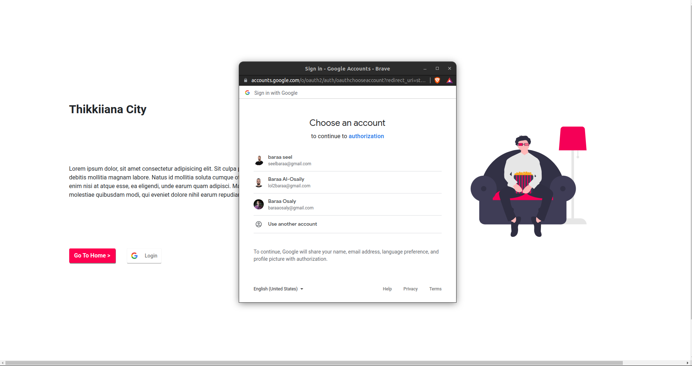
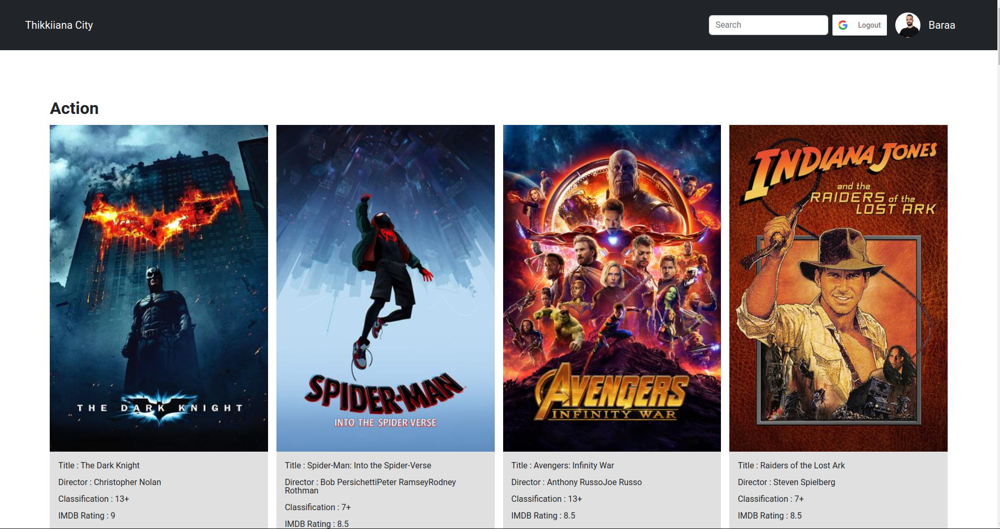
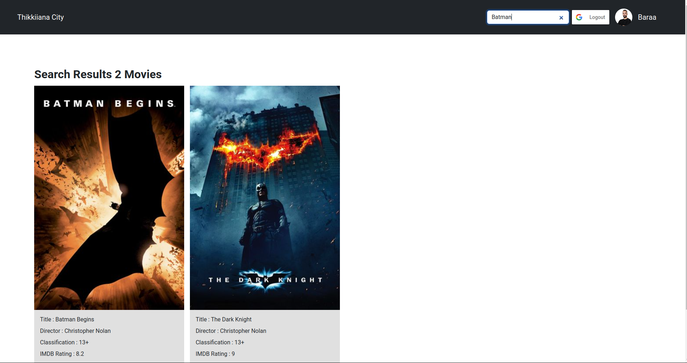
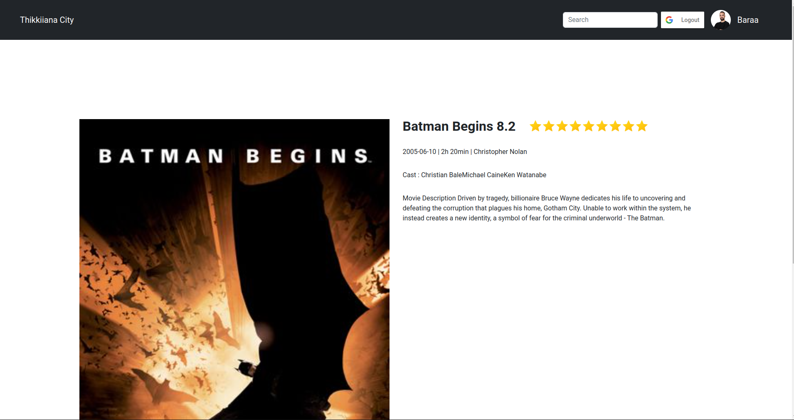

# Avertra Assignment

## This guide will help you to run the assignment code

- You have to clone the repo
- get inside client directory 
- use this command to install the backages `yarn install`
- In case the above command not work you have to use the following command `yarn install --force`
- You have to change `.env.example` to `.env`
- Run the following command to run the code `yarn start`
- To run the test you have to run the following command `yarn test` or `npm test`

## Demo

### Landing page

### Sign in

### Main page

### Search page

### Details

